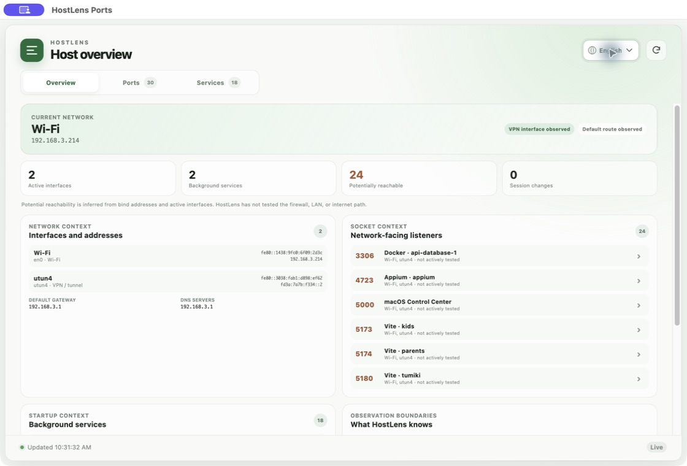
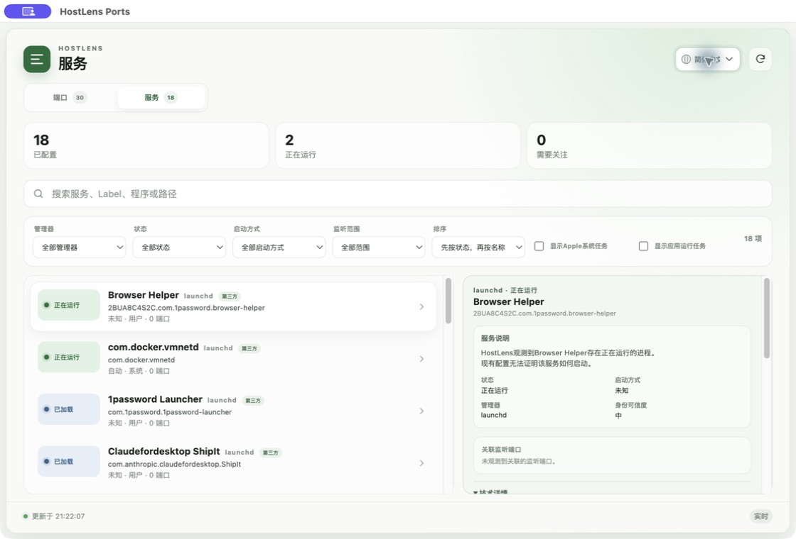
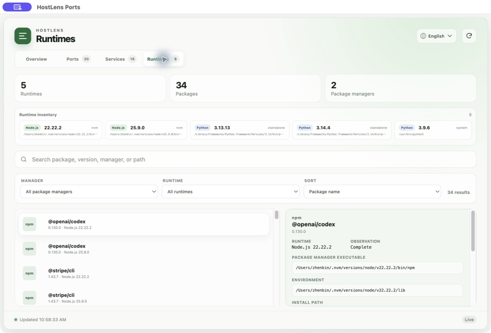
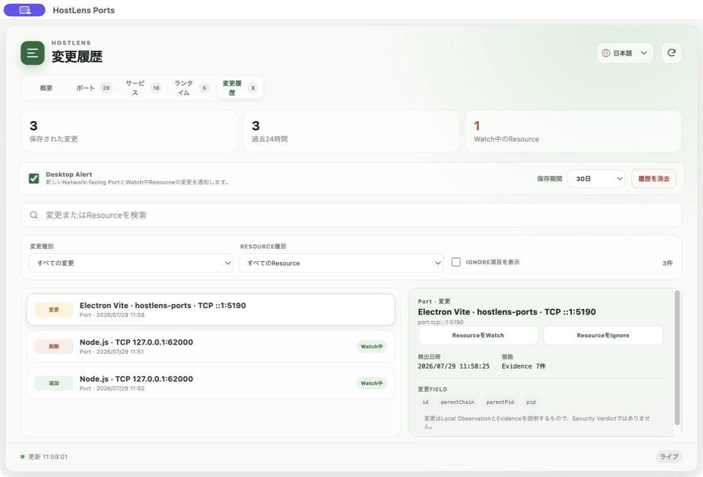

<div align="center">
  

  # HostLens Ports

  **MacまたはLinux Hostで待受中のポートと、それを開いたプロセスを確認。**

  [](LICENSE)
  
  
</div>

<p align="center">
  <a href="README.md"></a>
  <a href="README.ja.md"></a>
  <a href="README.zh-CN.md"></a>
</p>

HostLens Portsは、`lsof`、`netstat`、`ss`などのコマンドを覚えなくても、
TCP待受ポートを確認できる軽量なオープンソースのデスクトップツールです。
ポートとプロセス、コマンド、バインドアドレス、ネットワーク公開範囲を関連付け、
検索しやすい画面にまとめます。
0.7ではUbuntuとRed Hat Enterprise LinuxをFirst-class Desktop Targetとし、
`ss` / Process、systemd、iproute2 Network Context、読み取り専用firewalld
Observation、Node / Python Package Inventoryに対応します。

現在のリリースは、ローカル専用かつ読み取り専用です。軽量SQLite Historyは
Host内に留まり、LLM、テレメトリー、アカウント、クラウドサービスは使用しません。










## 主な機能

- macOS、Ubuntu、RHEL上のTCP待受ポートをリアルタイムに検出
- Current Network、Service、Network-facing Listener、Session Changeをまとめる
  Host Overview
- Interface、IPv4 / IPv6 Address、Route、DNS、観測可能なVPN Interfaceを
  Localで収集
- Observed BindingとPotential Reachabilityを区別するSocket-to-Interface
  Relationship
- プロセス、PID、親PID、ユーザー、完全なコマンドを表示
- 実行ファイル、作業ディレクトリ、親プロセスチェーンのEvidence
- Vite、Next.js、React Tooling、Nuxt、webpackなどのProjectを考慮した名称
- Package Script、launchd、Homebrew Services、Docker、Native App、
  手動起動のLaunch Source識別
- launchd、Homebrew Services、systemdのための独立したServices View
- Running、Loaded、Stopped、Failed、Disabled、UnknownのService状態
- Automatic、On-demand、Disabled、UnknownのStartup Behavior
- ServiceからProcess、Listening PortへのRelationship
- LaunchAgent / LaunchDaemon Plistから停止中のConfigured Serviceも検出
- Apple System Jobと一時的なApplication Jobは保持しつつDefaultで非表示
- Serviceの検索、Manager / Status / Startup / Scope Filter、安定したSort
- System、Homebrew、nvm、pyenvなどからNode.js / Python Runtimeを検出
- npm、Yarn、pnpm、pip、pipxのPackageをManager、Version、Environment、
  Install Path、ExecutableのEvidenceとともに表示
- Package検索、Runtime / Manager Filter、安定したSort、Listener /
  Serviceとの高ConfidenceなRelationship
- 推論したIdentityごとのConfidenceと確認可能なEvidence
- 現在のSession内におけるNew / Changed / Closedのメモリ内検出
- Added / Changed / Removedを型付きEventとして保存する限定Local Timeline
- Watch / Ignore、Retention、Notification Cooldown、新しいNetwork-facing
  PortまたはWatch中Resource向けDesktop Alert
- ポート、プロセス、プロジェクト、アドレス、コマンドで検索
- ポート範囲、プロセス所有元、公開範囲で絞り込み
- ポート、プロセス名、所有元、公開範囲で並べ替え
- ローカル専用とネットワーク公開中のポートを区別
- メニューバーのクイックビューと完全なデスクトップ画面
- 英語、日本語、簡体字中国語のUI
- Friendly Summaryと展開可能なTechnical Details
- Point-in-time Disclaimer付きの完全版・Sanitized版Copy / Export
- 完全表示・Copy可能なCommandと明示的なPartial Observation
- 管理者権限を要求しない読み取り専用動作
- Linux Desktop向け`.AppImage`、`.deb`、`.rpm` Packaging
- Linux ToolやProcess Ownerが取得できない場合もPartial Resultを保持

<p align="center">
  
</p>

## 対象ユーザー

- **個人：** バックグラウンドやNetwork-facingの動作を普通の言葉で理解し、
  必要なときは技術的Evidenceを確認できます。
- **Developer：** PortをProject、Command、Runtime、Parent Process、
  Launch Sourceへ関連付けます。
- **中小企業の情シス：** Enterprise監視Stackなしで重要なMacとLinux Hostを
  一貫して確認し、ChangesとEvidence付きSummaryを利用できます。

HostLensは一台のMachineから始まります。長期的にはComputer、Server、NAS、
Printer、Router、Wi-Fi、Shared ServiceをLocal-firstで理解できる環境へ発展します。

## クイックスタート

### 必要環境

- macOS 13+、Ubuntu 22.04+ / 24.04、またはRHEL 9
- Node.js 22以降
- Yarn Classic 1.22

### 開発モードで実行

```bash
git clone https://github.com/zhenbin-z/hostlens-ports.git
cd hostlens-ports
yarn install
yarn dev
```

開発用レンダラーはポート`5190`を使用します。Electronは通常のアプリ画面を開き、
Dockとメニューバーの両方からHostLens Portsを利用できる状態にします。

## 表示内容の見方

HostLensでは、次の3つを別々の概念として扱います。

| 分類 | 値 | 意味 |
| --- | --- | --- |
| ポート範囲 | システム、サービス、動的 | ポート番号の範囲 |
| 所有元 | システム、サービス、アプリ、開発、不明 | プロセスの推定分類 |
| 公開範囲 | ローカルのみ、ネットワーク公開、不明 | ソケットが待受するインターフェース |

ポート番号の範囲は次のとおりです。

- **システム：** `0–1023`
- **サービス：** `1024–49151`
- **動的：** `49152–65535`

「ネットワーク公開」は、非ループバックアドレスまたは全インターフェースに
バインドされていることを示します。ファイアウォール、ルーター、VPN、
インターネット経由で実際に到達できることを保証するものではありません。

プロセス分類と表示名は、実行ファイルのパス、コマンド、App Bundle、
プロジェクトディレクトリから推定します。HostLensは根拠として元の
プロセス名とコマンドを常に表示します。

## プライバシーとセキュリティ

HostLens Portsは次の方針で動作します。

- すべてローカルで実行
- ポート調査はElectronのメインプロセスだけで実行
- Rendererには小さく型付けされたAPIだけを公開
- マシン情報を外部へ送信しない
- プロセス、サービス、ファイアウォール、ソケットを変更しない
- 管理者権限を要求しない

権限を昇格しないため、一部のシステムプロセスでは情報が不足する場合があります。
HostLensは広い権限を要求せず、不足する情報を「不明」として扱います。

## 対応状況

| プラットフォーム | 状況 |
| --- | --- |
| macOS | 対応済み：`lsof`と`ps`によるライブスキャン |
| Ubuntu | 対応済み：`ss`、Process、systemd、iproute2、Package |
| Red Hat Enterprise Linux | 対応済み：`ss`、Process、systemd、iproute2、firewalld |

LinuxのTray表示はDesktop Environmentに依存します。GNOMEで
StatusNotifier / AppIndicator Extensionがない場合も、通常のApp Windowは
利用できます。

## 開発コマンド

```bash
yarn dev                # 開発モードでElectronを起動
yarn typecheck          # TypeScriptの型チェック
yarn test               # Scanner、Identity、Session、Privacyのテスト
yarn benchmark:scanner  # macOSで20回のReference Benchmarkを実行
yarn benchmark:services # Port、Service、RelationshipをBenchmark
yarn benchmark:network  # macOS Network ContextをBenchmark
yarn benchmark:runtimes # Runtime / PackageのCold / Cache ScanをBenchmark
yarn build              # プロダクションビルドを作成
yarn dist:mac           # 署名なしのローカル.dmgと.zipを作成
```

## OSSにする理由

HostLensは機密性のあるLocal System Contextを扱うため、何を収集し、データが
Machine外へ出るかをユーザーが確認できる必要があります。Open Developmentにより、
OS Version、Install方法、Hardware、Local Configurationごとの互換性もCommunity
とともに改善できます。

HostLensは薄いAI Wrapperではなく、長く続く公開Infrastructure Projectを目指します。
詳しくは[HostLensをOSSにする理由](docs/OPEN_SOURCE.ja.md)をご覧ください。

## Roadmap

HostLensは段階的に構築します。

```text
See → Identify → Relate → Remember → Explain → Advise → Operate safely
```

- **0.1.0 — See：** macOSのTCP Listenerと対応Processをリアルタイム表示
- **0.2.0 — Host Identity and Session Awareness：** Scannerの信頼性、
  Projectと起動元の識別、EvidenceとConfidence、メモリ上のNew / Changed /
  Closed、Friendly / Technical View、共有可能なCurrent-state Summaryを実装
- **0.3.0 — Services & Startup Inspector：** launchdとHomebrew Serviceを収集し、
  停止中の設定を保持、StatusとStartup Behaviorを正規化し、ServiceをProcessと
  Listening Portへ関連付け
- **0.4.0 — Host Overview & Network Context：** Interface、Address、Route、
  DNS、VPN Context、SocketとInterfaceのRelationshipを実装済み
- **0.5.0 — Runtimes & Global Packages：** Node.js / Python Runtimeと
  npm / Yarn / pnpm / pip / pipx PackageのHost Activityへの関連付けを実装済み
- **0.6.0 — Persistent Changes & Alerts：** Local Snapshot、型付きChange、
  限定Timeline、Watch / Ignore、Cooldown、Desktop Notificationを実装済み
- **0.7.0 — Ubuntu / RHEL First-class Support：** Linux Collector、systemd、
  Network、firewalld Observation、Package、Persistence、Alert、Desktop
  Packagingを実装済み
- **その後：** 読み取り専用MCP、任意のExplain、Environment Intelligence、
  その後にSupervised Operationsを検討

HostLensはAIがなくても有用であり続けます。将来のAI機能は、明示的に選択された
最小限の構造化データのみを利用し、無制限のShellにはアクセスしません。

詳細は[Roadmap](docs/ROADMAP.ja.md)をご覧ください。

## プロジェクトドキュメント

- [プロダクト思想](docs/PRODUCT.ja.md)
- [アーキテクチャ](docs/ARCHITECTURE.ja.md)
- [セーフティモデル](docs/SAFETY.ja.md)
- [Roadmap](docs/ROADMAP.ja.md)
- [Scanner Benchmark](docs/BENCHMARKS.ja.md)
- [HostLensをOSSにする理由](docs/OPEN_SOURCE.ja.md)

## コントリビューション

IssueとPull Requestを歓迎します。変更を送る前に
[CONTRIBUTING.md](CONTRIBUTING.md)をお読みください。

ポートとプロセスの関連付けに誤りがある場合は、OSバージョンと再現可能な
匿名化済みコマンド出力を添えてください。秘密情報、顧客名、ユーザー名、
プライベートなファイルパスは投稿しないでください。

## ライセンス

HostLens Portsは[Apache License, Version 2.0](LICENSE)で公開されています。

Copyright 2026 Zhenbin Zhang. HostLensの名称とロゴはZhenbin Zhangの商標です。
表示と商標に関する情報は[NOTICE](NOTICE)をご覧ください。
