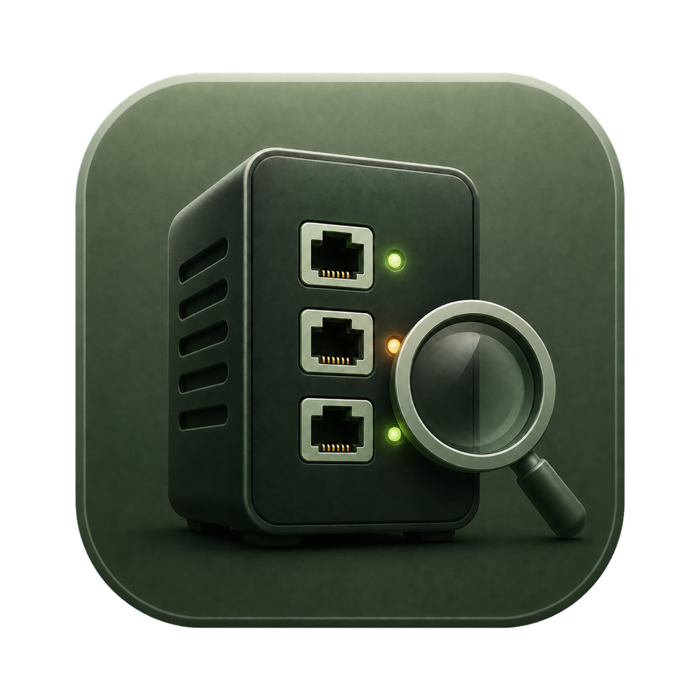
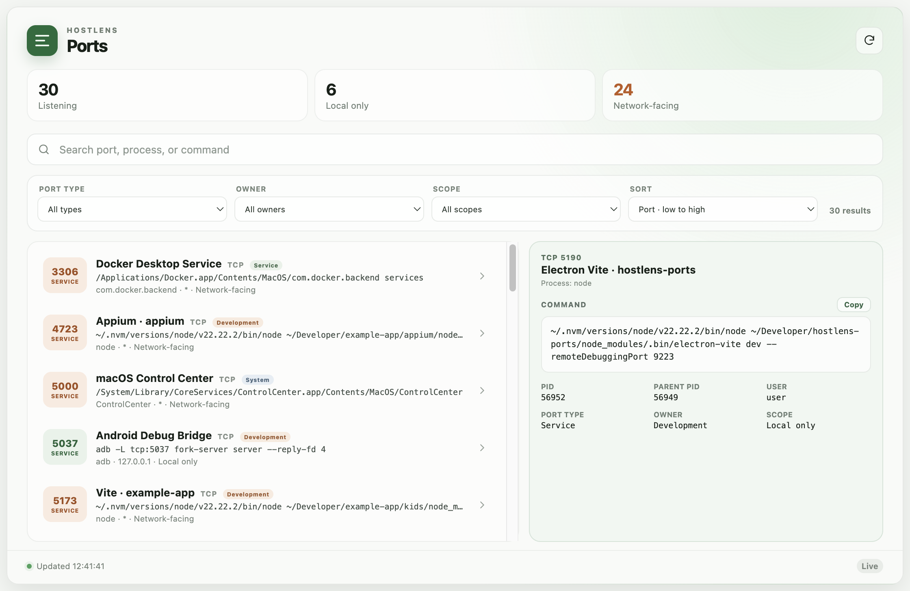
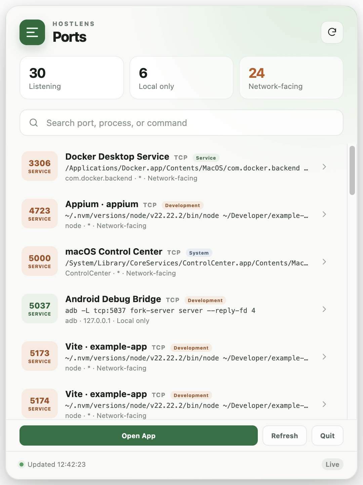

<div align="center">
  

  # HostLens Ports

  **查看Mac正在监听的端口，以及打开它们的进程。**

  [](LICENSE)
  
  
</div>

<p align="center">
  <a href="README.md"></a>
  <a href="README.ja.md"></a>
  <a href="README.zh-CN.md"></a>
</p>

HostLens Ports是一款轻量、开源的桌面工具，让你无需记忆`lsof`、`netstat`
或`ss`命令，也能检查TCP监听端口。它会关联端口对应的进程、完整命令、
监听地址和网络暴露范围，并通过可搜索的界面展示结果。

当前版本完全在本地以只读方式运行，不包含LLM、数据库、遥测、账号或云服务。



## 功能

- 实时发现macOS上的TCP监听端口
- 查看进程、PID、父进程PID、用户和完整命令
- 显示`Vite · project-name`、`Docker Desktop Service`等易懂名称
- 按端口、进程、项目、地址或命令搜索
- 按端口范围、进程类别和监听范围筛选
- 按端口、进程名称、进程类别或监听范围排序
- 区分仅本机监听和网络可访问的端口
- 菜单栏快速视图和完整桌面窗口
- 英文、日文和简体中文界面
- 完整显示并可复制命令详情
- 只读运行，不需要管理员辅助程序
- 为未来Linux支持预留平台扫描器抽象

<p align="center">
  
</p>

## 快速开始

### 环境要求

- macOS
- Node.js 22或更高版本
- Yarn Classic 1.22

### 以开发模式运行

```bash
git clone https://github.com/zhenbin-z/hostlens-ports.git
cd hostlens-ports
yarn install
yarn dev
```

开发模式的界面服务器使用端口`5190`。Electron会打开完整应用窗口，并让
HostLens Ports同时保留在Dock和菜单栏中。

## 如何理解扫描结果

HostLens会分别显示三个不同概念：

| 维度 | 可选值 | 含义 |
| --- | --- | --- |
| 端口范围 | 系统、服务、动态 | 端口号所处的数字范围 |
| 进程类别 | 系统、服务、应用、开发、未知 | 对进程用途的启发式分类 |
| 监听范围 | 仅本机、网络可访问、未知 | Socket正在监听的网络接口 |

端口数字范围如下：

- **系统：** `0–1023`
- **服务：** `1024–49151`
- **动态：** `49152–65535`

“网络可访问”表示进程绑定在非回环地址或所有网络接口上，不代表该端口一定
可以穿过防火墙、路由器、VPN或互联网访问。

进程类别和显示名称是根据可执行文件路径、命令、App Bundle和项目目录推测的。
HostLens始终保留原始进程名称和完整命令作为判断依据。

## 隐私与安全

HostLens Ports：

- 完全在本地运行；
- 仅在Electron主进程中执行端口检查；
- 只向界面暴露少量、具有类型约束的API；
- 不会将机器信息发送到网络；
- 不会修改进程、服务、防火墙规则或Socket；
- 不申请管理员权限。

由于不提升权限，部分系统进程的信息可能不完整。HostLens会将缺失信息显示为
“未知”，而不是申请过大的系统权限。

## 平台支持

| 平台 | 状态 |
| --- | --- |
| macOS | 已支持：使用`lsof`和`ps`实时扫描 |
| Ubuntu | 计划支持 |
| Red Hat Enterprise Linux | 计划支持 |

## 开发命令

```bash
yarn dev        # 以开发模式启动Electron
yarn typecheck  # 检查TypeScript类型
yarn test       # 运行扫描器和进程识别测试
yarn build      # 创建生产构建
yarn dist:mac   # 创建未签名的本地.dmg和.zip
```

## Roadmap

HostLens 按照以下层次逐步构建：

```text
See → Identify → Relate → Remember → Explain → Advise → Operate safely
```

- **0.1.0 — See：** 实时显示 macOS TCP Listener 及其对应进程。
- **0.2.0 — Host Identity：** 提升 Scanner 可靠性，识别项目和启动来源，
  附带 Evidence 与 Confidence，并显示内存中的 New / Changed / Closed 状态。
- **之后：** 扩展 Unified Host Model，加入 Linux 一等支持、持久化变化与
  Alert、只读 MCP 和可选 Explain，最后才考虑 Supervised Operations。

HostLens 在没有 AI 时也必须保持实用。未来 AI 功能只能使用用户明确选择的最少
结构化数据，并且不能获得无限制 Shell。

请阅读完整的[Roadmap](docs/ROADMAP.zh-CN.md)。

## 项目文档

- [产品理念](docs/PRODUCT.zh-CN.md)
- [架构](docs/ARCHITECTURE.zh-CN.md)
- [安全模型](docs/SAFETY.zh-CN.md)
- [Roadmap](docs/ROADMAP.zh-CN.md)

## 参与贡献

欢迎提交Issue和Pull Request。提交更改前请阅读
[CONTRIBUTING.md](CONTRIBUTING.md)。

如果发现端口与进程关联错误，请提供操作系统版本和经过脱敏、可以复现问题的
命令输出。请勿发布密钥、客户名称、用户名或私人文件路径。

## 许可证

HostLens Ports基于[Apache License, Version 2.0](LICENSE)发布。

Copyright 2026 Zhenbin Zhang。HostLens名称和Logo是Zhenbin Zhang的商标。
署名与商标信息请参阅[NOTICE](NOTICE)。
